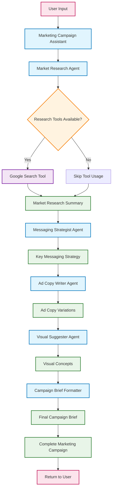
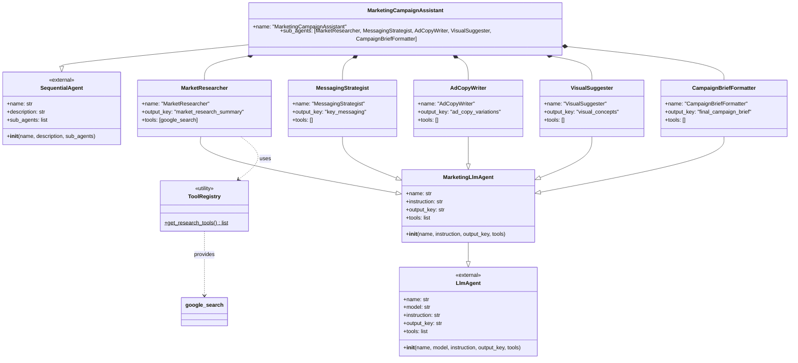

# Marketing Agents System Documentation

## Overview

This system implements a multi-agent marketing campaign assistant using Google's Agent Development Kit (ADK). It orchestrates several specialized agents to create comprehensive marketing campaigns through a sequential workflow.

## Executive Summary

The Marketing Agents System is an AI-powered marketing campaign generation platform that automates the entire campaign development process from initial market research to final campaign brief delivery. By leveraging Google's Generative AI capabilities and a multi-agent architecture, the system delivers professional-quality marketing campaigns in minutes rather than days.

The platform employs five specialized AI agents working in sequence: Market Research, Messaging Strategy, Ad Copy Writing, Visual Concept Development, and Campaign Brief Formatting. Each agent is optimized for its specific domain expertise, ensuring high-quality outputs at every stage of the campaign development process.

## Key Value Propositions

###  **Accelerated Campaign Development**

-   **Speed Improvement**: Complete campaign development in minutes vs. traditional weeks
-   **Automated Workflow**: Eliminates manual handoffs between marketing disciplines
-   **Consistent Quality**: Maintains professional standards across all campaign elements

###  **Specialized Expertise**

-   **Domain-Specific Agents**: Each agent optimized for specific marketing functions 
-   **Research-Driven Approach**: Market research agent provides data-backed insights
-   **Creative Diversity**: Multiple ad copy variations and visual concepts generated


## Architecture

The system follows a hierarchical agent pattern where a root orchestrator agent coordinates multiple specialized sub-agents, each responsible for a specific aspect of marketing campaign.

## Configuration

### Environment Setup

The system uses environment variables for configuration with fallback defaults:
```python
# Environment variable loading with fallback mechanism
try:
    from dotenv import load_dotenv
    load_dotenv()
    MODEL_NAME = os.environ.get("GOOGLE_GENAI_MODEL", "gemini-2.0-flash")
except ImportError:
    print("Warning: python-dotenv not installed. Ensure API key is set")
    MODEL_NAME = "gemini-2.0-flash"
```

**Environment Variables:**

-   `GOOGLE_GENAI_MODEL`: Specifies the Google Generative AI model (default: "gemini-2.0-flash")

## Core Components

### 1. ToolRegistry Class

A utility class that manages tool integrations for the agents.

python

```python
class ToolRegistry:
    @staticmethod
    def get_research_tools():
        return [google_search]
```

**Purpose:**  Centralizes tool management and makes it easy to add new tools or modify existing ones.

**Methods:**

-   `get_research_tools()`: Returns a list of research-related tools (currently includes Google Search)

### 2. MarketingLlmAgent Class

A specialized LLM agent that extends the base  `LlmAgent`  class with marketing-specific configurations.

```python
class MarketingLlmAgent(LlmAgent):
    def __init__(self, name, instruction, output_key, tools=None):
        super().__init__(
            name=name,
            model=MODEL_NAME,
            instruction=instruction,
            output_key=output_key,
            tools=tools or []
        )
```

**Parameters:**

-   `name`: Unique identifier for the agent
-   `instruction`: System prompt/instruction for the agent's behavior
-   `output_key`: Key used to store the agent's output in the workflow
-   `tools`: Optional list of tools the agent can use

## Agent Instances

### 1. Market Research Agent

-   **Name:**  MarketResearcher
-   **Purpose:**  Conducts market research using available tools
-   **Tools:**  Google Search
-   **Output Key:**  market_research_summary

### 2. Messaging Strategist Agent

-   **Name:**  MessagingStrategist
-   **Purpose:**  Develops key messaging strategies based on research
-   **Tools:**  None
-   **Output Key:**  key_messaging

### 3. Ad Copy Writer Agent

-   **Name:**  AdCopyWriter
-   **Purpose:**  Creates advertising copy variations
-   **Tools:**  None
-   **Output Key:**  ad_copy_variations

### 4. Visual Suggester Agent

-   **Name:**  VisualSuggester
-   **Purpose:**  Suggests visual concepts for campaigns
-   **Tools:**  None
-   **Output Key:**  visual_concepts

### 5. Formatter Agent

-   **Name:**  CampaignBriefFormatter
-   **Purpose:**  Formats final campaign brief
-   **Tools:**  None
-   **Output Key:**  final_campaign_brief

## Workflow Orchestration

### Campaign Orchestrator

The  `campaign_orchestrator`  is a  `SequentialAgent`  that coordinates all sub-agents in a specific order:

1.  **Market Research**  → Gathers market intelligence
2.  **Messaging Strategy**  → Develops key messaging
3.  **Ad Copy Writing**  → Creates advertisement copy
4.  **Visual Suggestions**  → Proposes visual concepts
5.  **Formatting**  → Produces final campaign brief

python

```python
campaign_orchestrator = SequentialAgent(
    name="MarketingCampaignAssistant",
    description=CAMPAIGN_ORCHESTRATOR_INSTRUCTION,
    sub_agents=[
        market_research_agent,
        messaging_strategist_agent,
        ad_copy_writer_agent,
        visual_suggester_agent,
        formatter_agent,
    ]
)
```

## System Flow Diagram


## Detailed System Flow

### Phase 1: Initialization

1.  **User Input**  → System receives campaign requirements
2.  **Marketing Campaign Assistant**  → Orchestrator begins sequential workflow

### Phase 2: Market Research

3.  **Market Research Agent**  → Analyzes market conditions
4.  **Tool Integration**  → Utilizes Google Search for external data
5.  **Research Summary**  → Consolidates findings into structured output

### Phase 3: Strategy Development

6.  **Messaging Strategist**  → Develops key messaging based on research
7.  **Key Messaging**  → Creates strategic messaging framework

### Phase 4: Creative Development

8.  **Ad Copy Writer**  → Generates multiple ad copy variations
9.  **Ad Copy Variations**  → Produces diverse creative content options

### Phase 5: Visual Planning

10.  **Visual Suggester**  → Recommends visual concepts and themes
11.  **Visual Concepts**  → Provides creative direction for visuals

### Phase 6: Final Assembly

12.  **Campaign Brief Formatter**  → Assembles all components into final brief
13.  **Final Campaign Brief**  → Delivers comprehensive campaign package

## UML Class Diagram


## Dependencies

### External Libraries

-   `google.adk.agents`: Provides  `LlmAgent`  and  `SequentialAgent`  classes
-   `google.adk.tools`: Provides  `google_search`  tool
-   `dotenv`: For environment variable loading (optional)
-   `os`: For environment variable access

### Internal Dependencies

-   `marketing_agents.instructions`: Contains all agent instruction constants. These highly tuned instructions ensure each specialist agent has clear guidance on their specific task 

## Usage

The system is designed to be used by instantiating the  `root_agent`  (which is an alias for  `campaign_orchestrator`):

```python
# The root agent is ready to use
result = root_agent.run(user_input)
```
or in the command line pointed at your root directory run the following command
```python
# Command to run the web based Dev UI
adk web
```
From here the user can interact with the root agent through the web based UI

## Design Patterns

1.  **Factory Pattern**:  `ToolRegistry`  acts as a factory for tool collections
2.  **Template Method**:  `MarketingLlmAgent`  provides a template for creating specialized agents
3.  **Composite Pattern**:  `SequentialAgent`  composes multiple sub-agents
4.  **Strategy Pattern**: Each agent implements a specific strategy for its domain

## Hallucination Mitigation

The system implements several strategies to minimize AI hallucination and ensure factual accuracy:

### 1. **Source Attribution Requirements**

-   **Market Research Agent**: Explicitly required to cite sources using short URLs or domain names
-   **Citation Format**: `[source: statista.com]` format for transparency and verification
-   **Authoritative Sources**: Prioritizes recent and authoritative sources through Google Search

### 2. **State-Based Information Flow**

-   **Controlled Input**: Each agent only uses information from previous agents via state variables
-   **No Invention Policy**: Agents explicitly instructed not to invent information
-   **Input Validation**: Messaging Strategist instructed: _"Only base your output on the provided input. Do NOT invent information"_

### 3. **Bounded Agent Scope**

-   **Limited Creativity**: Ad Copy Writer limited to 30 words per variation to prevent elaboration
-   **Specific Formats**: Each agent has defined output formats to prevent drift
-   **Review Checkpoints**: Formatter Agent required to "double-check that all information is copied accurately"

### 4. **Grounded Research Foundation**

-   **Tool Integration**: Market Research Agent uses Google Search for real-time data
-   **Research-First Approach**: All subsequent agents build on researched facts
-   **External Validation**: Search results provide external grounding for all claims

### 5. **Verification Instructions**

**Key** agent instructions that prevent hallucination:

```
Market Researcher: "Clearly cite or mention the source for each insight"
Messaging Strategist: "IMPORTANT: Only base your output on the provided input"
Formatter: "Do not invent or add any new information"
```

### 6. **Sequential Validation**

-   **Layered Review**: Each agent validates previous agent outputs
-   **Fact Preservation**: Information passes through multiple validation layers

### 7. **Low Temperature Parameter**

-   **Consistency Control**: Temperature set to 0.3 to minimize creative variation
-   **Deterministic Outputs**: Low temperature ensures consistent responses to identical prompts
-   **Reduced Hallucination**: Lower creativity parameter reduces likelihood of invented information
-   **Reproducible Results**: Same inputs produce nearly identical outputs for reliable testing

## Error Handling
-   Falls back to default model if environment loading fails
-   Provides empty tool lists as defaults
-   Warns users about missing dependencies
